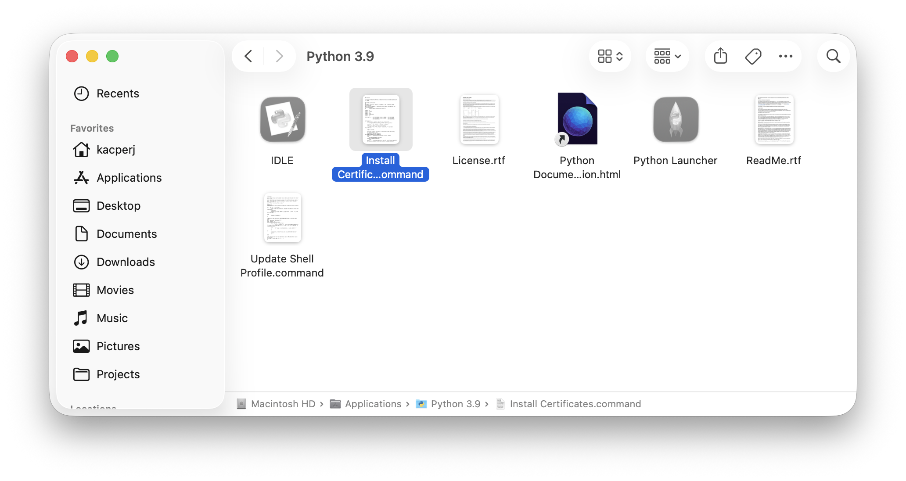

This page walks you through getting HLPatcher downloaded and running on your Mac for the first time.

## Step 1: Download HLPatcher

Go to the [GitHub Releases](https://github.com/kacper-jar/HLPatcher/releases) page and download the latest release archive.

Once downloaded, **unzip** the archive to a location of your choice (e.g. your Desktop or Downloads folder).

## Step 2: Install Xcode Command Line Tools

HLPatcher builds native 64-bit engine binaries from source. This requires the Xcode Command Line Tools to be installed.

Open **Terminal** and run:

```shell
xcode-select --install
```

A system prompt will appear asking you to confirm the installation. Click **Install** and wait for it to finish.

## Step 3: Install Python Certificates

Open your **Applications** folder and find the **Python 3.9** folder. Inside, double-click the `Install Certificates.command` script to run it. This is required to verify SSL certificates later on during patching.



## Step 4: Run HLPatcher

In **Terminal**, navigate to the folder where you unzipped HLPatcher, then run:

```shell
chmod +x ./patcher.sh && ./patcher.sh
```

The `patcher.sh` bootstrap script will automatically verify prerequisites, set up a Python virtual environment, install dependencies, and launch HLPatcher.

!!! tip
    You only need to run `chmod +x ./patcher.sh` once. On subsequent runs, just use `./patcher.sh`.

## Step 5: Follow the UI

Once HLPatcher opens, it will guide you through the rest of the process:

1. **Select your games folder** – point HLPatcher to your Steam `common` folder (pre-filled automatically if using the default Steam path).
2. **Select games to patch** – unpatched games are pre-selected. You'll see live estimates for time and disk space.
3. **Choose patching options** – select **Latest** or **Stable** engine builds and whether to create a backup.
4. **Switch Steam branches** *(Source Engine games only)* – if you're patching Half-Life 2, Portal or similar games, HLPatcher will ask you to switch them to their legacy Steam branch before continuing.
5. **Wait for patching to complete** – a progress bar will track each component as it's being patched.

!!! note
    After patching, macOS may block `SDL2.framework` on first launch. If this happens, go to **System Settings**, then **Privacy & Security** and click **Open Anyway**.

Once done, close HLPatcher and launch your games from Steam as usual.
