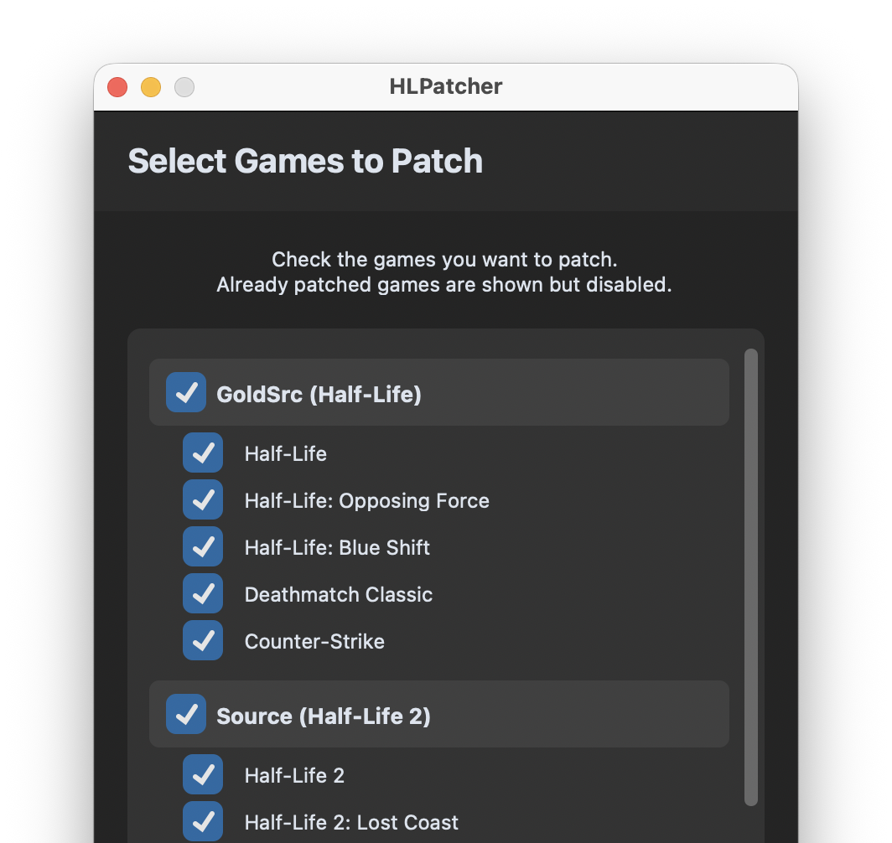

---
hide:
  - navigation
  - toc
---

{ width="400" }

# HLPatcher

HLPatcher makes Half-Life and other Valve games playable on modern ARM Macs that only support 64-bit applications.

It lets users to enjoy the game again without the hassle of manual binary update.

[Get Started](getting-started.md){ .md-button .md-button--primary }

## Supported Games

-   **Half-Life**

    [:octicons-mark-github-16: Source Code](https://github.com/FWGS/hlsdk-portable/tree/hlfixed) · [:octicons-person-24: Flying with Gauss](https://github.com/FWGS)

-   **Half-Life: Opposing Force**

    [:octicons-mark-github-16: Source Code](https://github.com/FWGS/hlsdk-portable/tree/opforfixed) · [:octicons-person-24: Flying with Gauss](https://github.com/FWGS)

-   **Half-Life: Blue Shift**

    [:octicons-mark-github-16: Source Code](https://github.com/FWGS/hlsdk-portable/tree/bshift) · [:octicons-person-24: Flying with Gauss](https://github.com/FWGS)

-   **Deathmatch Classic**

    [:octicons-mark-github-16: Source Code](https://github.com/FWGS/hlsdk-portable/tree/dmc) · [:octicons-person-24: Flying with Gauss](https://github.com/FWGS)

-   **Counter-Strike 1.6**

    [:octicons-mark-github-16: Source Code](https://github.com/Velaron/cs16-client) · [:octicons-person-24: Velaron](https://github.com/Velaron)

-   **Half-Life: Source**

    [:octicons-mark-github-16: Source Code](https://github.com/nillerusr/source-engine) · [:octicons-person-24: Nillerusr](https://github.com/nillerusr)

-   **Half-Life 2**

    [:octicons-mark-github-16: Source Code](https://github.com/nillerusr/source-engine) · [:octicons-person-24: Nillerusr](https://github.com/nillerusr)

-   **Half-Life 2: Episode One**

    [:octicons-mark-github-16: Source Code](https://github.com/nillerusr/source-engine) · [:octicons-person-24: Nillerusr](https://github.com/nillerusr)

-   **Half-Life 2: Episode Two**

    [:octicons-mark-github-16: Source Code](https://github.com/nillerusr/source-engine) · [:octicons-person-24: Nillerusr](https://github.com/nillerusr)

-   **Half-Life 2: Lost Coast**

    [:octicons-mark-github-16: Source Code](https://github.com/nillerusr/source-engine) · [:octicons-person-24: Nillerusr](https://github.com/nillerusr)

-   **Portal**

    [:octicons-mark-github-16: Source Code](https://github.com/nillerusr/source-engine) · [:octicons-person-24: Nillerusr](https://github.com/nillerusr)

## Thanks to

-   **Flying with Gauss**

    [:octicons-link-24: Website](https://xash.su/) · [:octicons-mark-github-16: GitHub](https://github.com/FWGS)

    For developing [Xash3D FWGS](https://github.com/FWGS/xash3d-fwgs) engine and [HLSDK Portable](https://github.com/FWGS/hlsdk-portable).

-   **Velaron**

    [:octicons-mark-github-16: GitHub](https://github.com/Velaron)

    For developing [Counter-Strike 1.6 reverse-engineered client](https://github.com/Velaron/cs16-client).

-   **Nillerusr**

    [:octicons-mark-github-16: GitHub](https://github.com/nillerusr)

    For developing modifications of the [Source Engine](https://github.com/nillerusr/source-engine) leak.

---

### Made with ❤️ by Kacper Jarosławski

[:octicons-link-24: Website](https://kzl21.ovh/) - [:octicons-mark-github-16: GitHub](https://github.com/kacper-jar)

